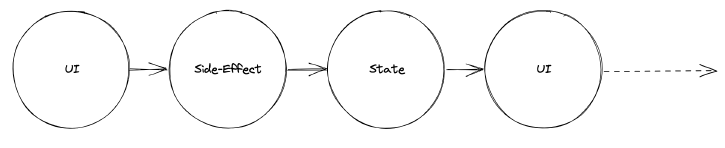

## Movie Reviewer Database App - Part 2

### Routing

Single-page applications (SPAs) are web apps that load once and then dynamically
update elements on the page using JavaScript. 

A URL is a reference to a web resource. We can think of the URL as being an
external keeper of state. By storing pieces of app state up at the level of the browser’s
location, we can enable users to bookmark the link, refresh the page, and share it
with others.

In a traditional web application with minimal JavaScript, the request flow for this
page might look like this:

 1. Browser makes a request to the server for this page
 2. The server uses the identifiers in the URL to retrieve data from a database.
 3. The server returns a populated HTML document along with any other assets
like CSS and images.
 4. The browser renders these assets.

 An evolution of that request flow using React might look like this:

 1. Browser makes a request to the server for this page.
 2. The server doesn’t care about the pathname. Instead, it just returns a standard that includes the React app and any static assets index.html.
 3. React app mounts.
 4. The React app extracts the identifiers from the URL and uses these identifiers
to make an API call to fetch the data.
 5. The React app renders the page using data it received from the API call.

 When the user request to view a new "page" in a React app, the browser already contains the full React app. There’s no need to have the browser make a new request to fetch the same app again from the server and re-mount it. The React app just needs to update the
 URL and then re-render itself with a new component-tree with the new data.

This is the idea of a ```JavaScript router```. 

Routing involves two primary pieces of functionality: 

- (1) Modifying the location of the app (the URL)
- (2) determining what React components to render at a given location

There are many routing libraries for React, but the community’s clear favorite is
<a href="https://reactrouter.com/">React Router</a>. React Router gives us a wonderful foundation for building rich applications that have hundreds or thousands of React components across many different views and URLs.

```JS
// index.js:

import { BrowserRouter } from "react-router-dom";

<BrowserRouter>
    <App />
</BrowserRouter>

// App.jsx

import { Routes, Route, Outlet, Link } from "react-router-dom";

 <ul>
    <li><Link to="/">Home</Link></li>
    <li><Link to="/about">About</Link></li>
    <li><Link to="/dashboard">Dashboard</Link></li>
 </ul>

 <Routes>
    <Route index element={<Home />} />
    <Route path="about" element={<About />} />
    <Route path="dashboard" element={<Dashboard />} />
 </Routes>
```

#### Official documentation

This is all you need to use: <a href="https://reactrouter.com/docs/en/v6">https://reactrouter.com/docs/en/v6</a>

### State

Both concepts, ```props``` and ```state```, have clear defined purposes: While props are used to pass information down the component hierarchy, state is used to change information over time. 

Functions starting with use are called Hooks. ```useState``` is a built-in Hook provided by React. You can find other built-in Hooks in the React API reference. You can also write your own Hooks by combining the existing ones.

By using useState, we are telling React that we want to have a stateful value which changes over
time. And whenever this stateful value changes, the affected components will re-render to use it. 

Calling the useState method will return an array with two entries: 

 - The fist entry represents the current state.
 - The second entry is a function to update this state.

```JS

import {useState} from 'react'

function App () {
   const [searchTerm, setSearchTerm] = useState('');
 
```


```JS
const handleChange = (event) => {
   setSearchTerm(event.target.value);
};
```

> Every component in a React application has one initial rendering followed by potential re-renderings.

Usually the initial rendering happens when a React component gets displayed in the browser. Then
whenever a side-effect occurs, like a user interaction (e.g. typing into an input field, API fetch call, etc.), the change is captured in React’s state which forces a re-rendering of all the components affected by this change (e.g. component that manages the state and all its descendant components).



### Callback Handlers in JSX

While props are passed down as information from parent to child components, state can be used
to change information over time. 

When using props as vehicle to transport information, we can only talk to descendant components. When using state, we can make information stateful, but this information can also only be passed down by using props as container.

There is no way to pass information up the component tree, since props are naturally only passed
downwards. However, we can introduce a ```callback handler```.

A callback handler is passed as function in props to another component and is executed there as callback handler and calls back to the place it was introduced.


The concept of the callback handler: 

1. We pass a function from a parent component (App) to a child component
2. We call this function in the child component, but have the actual implementation of the called function in the parent component (App). 
3. When an (event) handler is passed as props from a parent component to its child component, it
becomes a callback handler. 
4. Functions that are passed down as callback handlers in props can be used to communicate up the component hierarchy.

### Lifting State

Always manage state at a component level where every component that’s interested
in it is one that either manages the state (using information directly from state, e.g. App component) or a component below the state managing component (using information from props). 

> If a component below needs to update the state, pass a callback handler down to it which allows this particular component to update the state above in the parent component. 

If a component below needs to use the state (e.g. displaying it), pass it down as props.


### Event Handler

Event handlers are your own functions that will be triggered in response to user interactions like clicking, hovering, focusing on form inputs, and so on.

```JS
export default function App () {

   const handleClick = () => {
       alert('You clicked me!');
   }

   return (
     <button onClick={handleClick}>
        Click me
     </button>
  )
}
```

The handleClick function was passed it as a prop to <button>.  ```handleClick``` is an event handler. 

Event handler functions:

  - Are usually defined inside your components.
  - Uses the naming convention of names that start with ```handle```, followed by the name of the event.

> Remember, functions passed to event handlers must be passed not called.

#### Correct:

The first example the handleClick function is passed as an onClick event handler. This tells React to remember it and only call your function when the user clicks the button.

The second example wraps an anonymous function which creates a function to be called later.

```JS
<button onClick={handleClick}>

<button onClick={() => handleClick('...')}>
```

#### Incorrect:

The ```()``` at the end of handleClick() fires the function immediately during rendering, without any clicks. This is because JavaScript inside the JSX { and } executes right away.

```JS
<button onClick={handleClick()}>
```

### Event Object

Event handlers receive an event object as their only argument. This event object is a cross-browser wrapper around the browser's native event object called ```SyntheticEvent```. It has the same interface as the browser’s native event, including stopPropagation() and preventDefault(), except the events work identically across all browsers.

React defines the supported events according to the <a href="https://www.w3.org/TR/DOM-Level-3-Events/">W3C spec</a>.

```JS
export default function App() {

  function handleSubmit(e) {
    e.preventDefault();
    console.log('You clicked submit.');
  }

  return (
     <form onSubmit={handleSubmit}>
      <button type="submit">Submit</button>
    </form>
  );
}
```

#### Passing Arguments to Event Handlers

It is common to want to pass an extra parameter to an event handler. 

```JS
<button onClick={(e) => addRow(id, e)}>Add Row</button>
```

In both cases, the ```e``` argument representing the React event will be passed as a second argument.