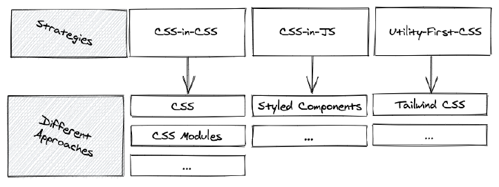

## Movie Reviewer Database App - Part 3


### React Asynchronous Data

Usually, data from a remote backend/database arrives asynchronously for client-side applications like React. Thus it’s often the case that we must render a component before we can initiate the data fetching. 


### Conditional Rendering

A ```conditional rendering``` in React always happens if we have to render different JSX based on information (e.g. state, props). Dealing with asynchronous data is a good use case for making use of conditional rendering. 

For example, when the application initializes for the first time, there is no
data to start with. Next, we are loading data and eventually, we have the data at our hands to display it. Sometimes the data fetching fails and we receive an error instead. 


### Styling

There are many ways (aka methodologies) to style a React application.



#### Modern Component Architecture

There are a few “hard problems” when it comes to CSS. One of the very hardest has to do with CSS global nature: how do we structure large applications to avoid specificity wars and naming collisions? How do we identify which styles affect a given element?


#### CSS Stylesheets 

Writing CSS in a stylesheet is probably the most common and basic approach to styling a React application.

Plain CSS (CSS in CSS) would be accomplished by either having a global CSS file (App.css) and having all of your styles in that one file OR creating separate .css files per component. Also, this would involve using preprocessors (e.g. SASS) as well.

#### CSS Modules

#### Styled Components (CSS-in-JS)

